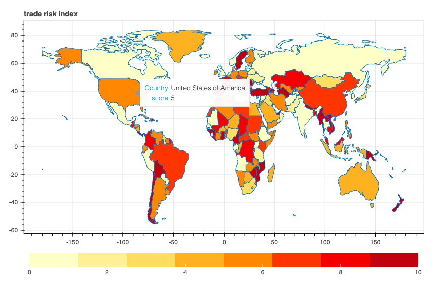

# COVID-19 International Trade Risk Index
A statistical model that detects COVID-19-induced reduction in traded volume. Results are 
visualized using an interactive world map with countries being colored according to their corresponding trade risk.
